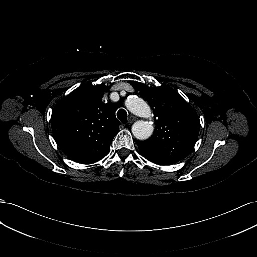
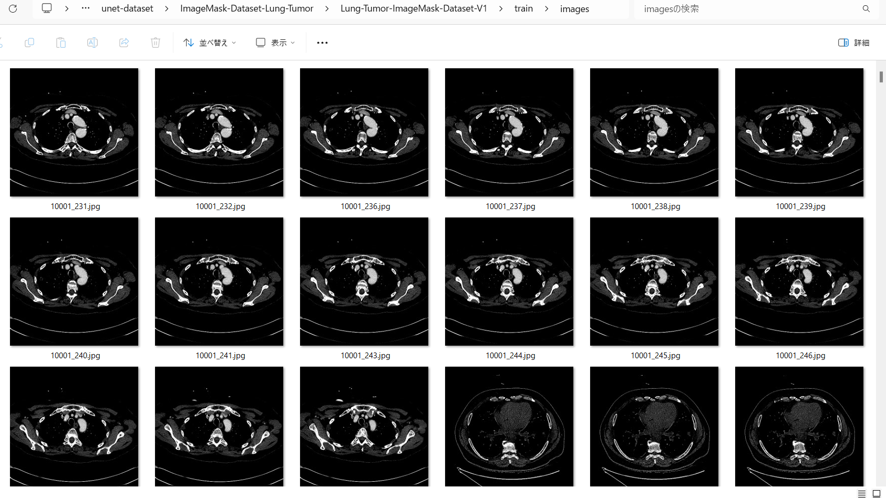
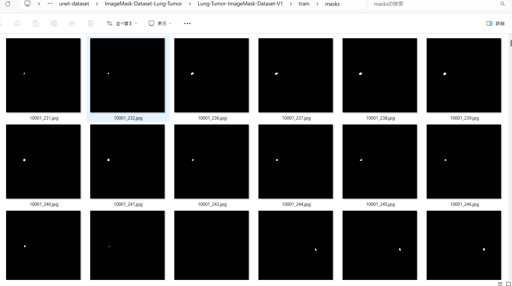
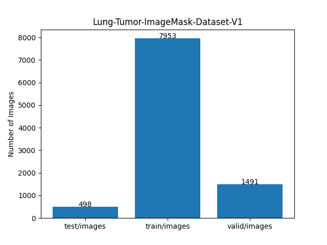

<h2>ImageMask-Dataset-Lung-Tumor (2024/05/03) </h2>
This is a simple ImageMask Dataset for Lung-Tumor Image Segmentation. 
The dataset used here has been taken from the following <a href="http://medicaldecathlon.com/">
Medical Segmentation Decathlon 
Generalisable 3D Semantic Segmentation
</a>. 
 
<b>Lung-Tumor image and mask samples</b> 

<table>
<tr>
<th>
Image 
</th>
<th>
Mask
</th>
</tr>
<td>

</td>
<td>

</td>
</table>

 
You can download our augmented dataset generated here from the google drive 
<a href="https://drive.google.com/file/d/1oNdi1K1Nq-uK52NY-03HuCtG_VTT4TR-/view?usp=sharing">Lung-Tumor-ImageMask-Dataset-V1.zip</a>.
 

<h3>1. Dataset Citation</h3>

The dataset used here has been taken from the following <a href="http://medicaldecathlon.com/">
Medical Segmentation Decathlon 
Generalisable 3D Semantic Segmentation
</a>. 
<pre>
All data will be made available online with a permissive copyright-license (CC-BY-SA 4.0), 
allowing for data to be shared, distributed and improved upon. 
All data has been labeled and verified by an expert human rater, and with the best effort 
to mimic the accuracy required for clinical use. 
To cite this data, please refer to https://arxiv.org/abs/1902.09063
</pre>

<h3>2. Download Lung dataset </h3>

Please download the original <b>Task06_Lung.tar</b> dataset from the
google drive 
Please expand the downloaded tar file under <b>ImageMask-Dataset-Lung-Tumor</b> directory, 
<pre>
./
 └─Task06_Lung
    ├─imagesTr
    ├─imagesTs
    └─labelsTr
</pre>

The imagesTr and labelsTr folder contains image and mask nii.gz files for training. 

<h3>3. Generate master dataset </h3>
Please run the following commnad for Python script <a href="./ImageMaskDatasetGenerator.py">ImageMaskDatasetGenerator.py</a> to generate
images and masks jgp files. 
<pre>
>python ImageMaskDatasetGenerator.py 
</pre>
, by which the following images and masks datasets of 512x512 pixel-size will be created under <b>Lung-master</b> directory. 
<pre>
./Lung-master
  ├─images
  └─masks
</pre>

<h3>4. Split master dataset </h3>
Please run the following command for Python script <a href="./split_master.py">split_master.py</a>.
<pre>
>python split_master.py
</pre>
, by wich test, train, and valid subdatasets will be created. 

<pre>
./Lung-Tumor-ImageMask-Dataset-V1
  ├─test
  ├─train
  └─valid
</pre>

Train images sample 
 
Train masks sample 
 

Dataset Statistics  

 

<h3>

References
</h3>
<b>1. Lung Tumor Image Segmentation from Computer Tomography Images Using MobileNetV2 and Transfer Learning</b> 
<pre>
Bioengineering (Basel). 2023 Aug; 10(8): 981.
Published online 2023 Aug 20. doi: 10.3390/bioengineering10080981
</pre>
Zainab Riaz, Bangul Khan, Saad Abdullah, Samiullah Khan, and Md Shohidul Islam1 
<pre>
https://www.ncbi.nlm.nih.gov/pmc/articles/PMC10451633/
</pre>

<b>2. Medical Segmentation Decathlon: Generalisable 3D Semantic Segmentation</b> 
<pre>
http://medicaldecathlon.com/
</pre>

